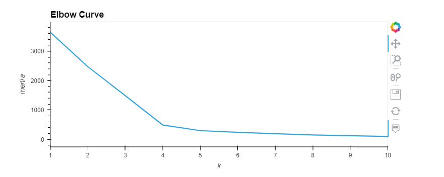
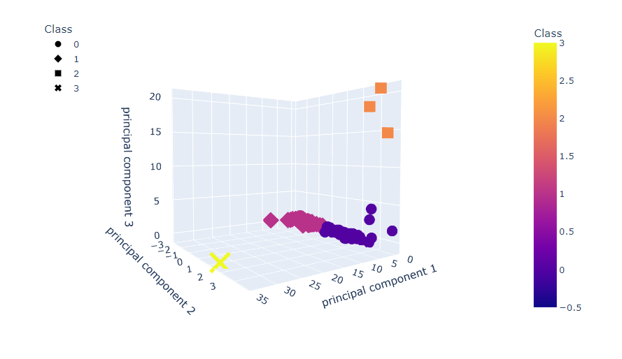
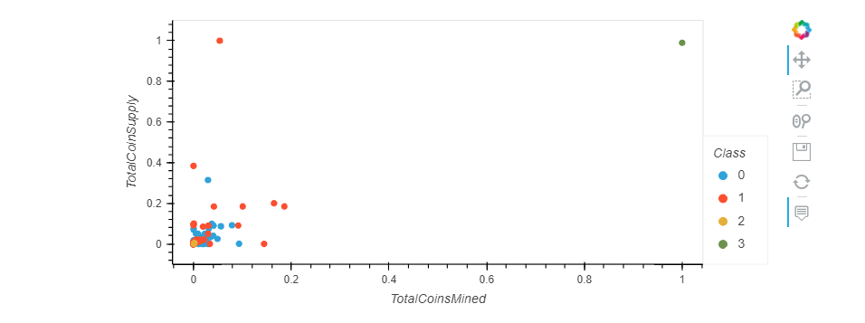

# Cryptocurrencies
Unsupervised Machine Learning 

## Purpose

The investment bank, Accoutability Accounting, wants to offer cryptocurrency investment portfolios for their customers. Using unsupervised machine learning, available cryptocurrencies on the trading market were grouped into a classification system.

## Visual Results

### Elbow Plot

### 3D Scatter

### Scatter Plot

